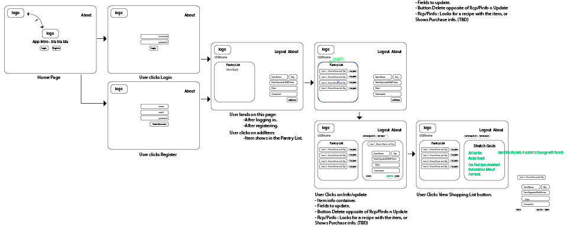
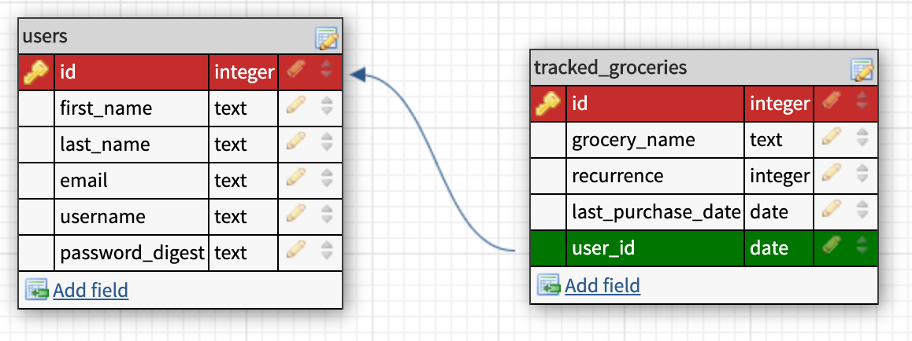
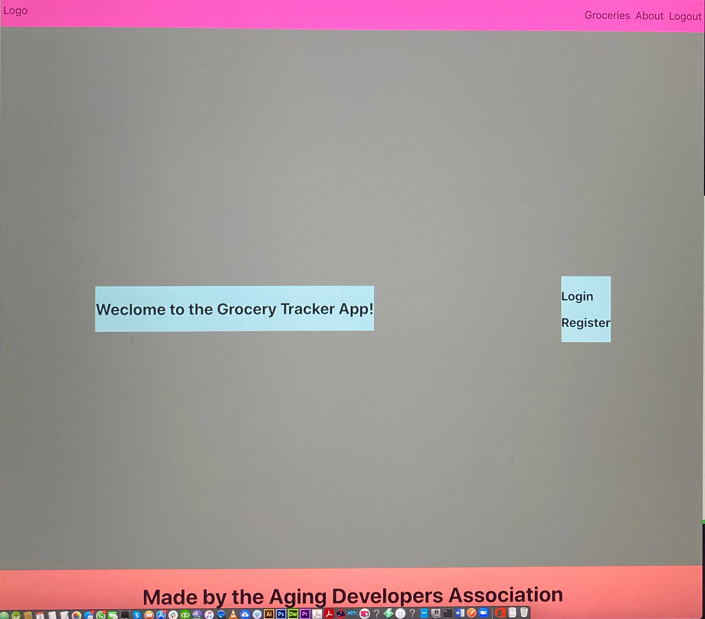
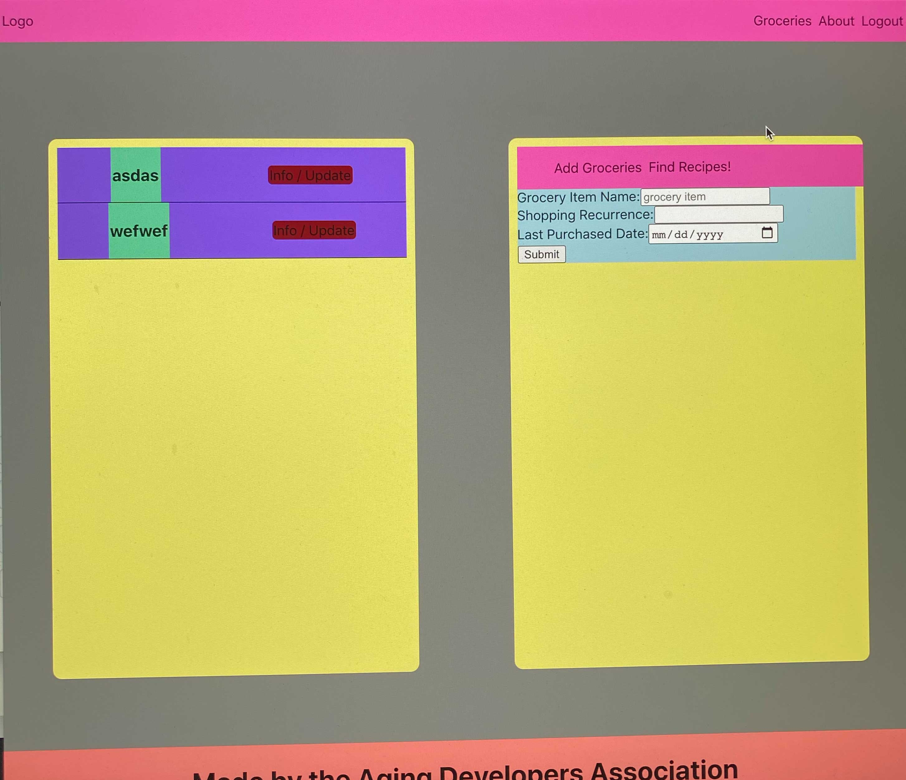

Aging Developers Association / 09/04/2020 

# ButterY - by A.D.A

(DISCLAIMER : the following information is subject to change based on developing phases and dev. brain capacity. )

## Our App

Managing groceries is hard.  Finding out what you need, making a list, finding the best deals at your local supermarket, 
and making sure you don’t forget to buy something you need.  Our grocery tracker app is here to help users make efficient 
use of their trips to the grocery store and let them know when they need to restock an item in their pantry.

### What is your project?

We will be building an app with REACT frontend that tracks the groceries an user has in the pantry
or needs to refill based on estimated consumption times (added by user).

### Wireframes!

### User Stories

  1.  As a user, I can know what groceries I need to buy in my next trip to the grocery store.
  2.  As a user, I can enter the groceries that I want to keep track of.
  3.  As a user, I can enter how often I’d like to buy a item I keep track of.
  4.  As a user, I can enter when I’ve purchased an item.
  5.  [Stretch Goal] As a user, I can know where I should go to get the best deal on an item I need.
  6.  [Stretch Goal] As a user, I can get recipe suggestions based on the items I am tracking in my pantry.
  
### Database Schema

### 3rd Party Technologies

- Moment.js.
- https://rapidapi.com/collection/grocery
- https://developer.nutritionix.com/ (if we find a suitable plan and scout the api for compliance with our project direciton)
- Google Search.

### Initial thoughts on app structure

- Seeding a database with API info (still figuring out how to).
- Show in an intuitive way the info scouted.
- Easy to use inviting design.
- Auth with REACT if brain doesn't fries.
- Deployment to heroku witrh REACT as front end.

### Phases of Completion

  - Create initial file structure
  - Deploy “Hello World” to Heroku
  - Create user from UI to DB
  - Deploy to Heroku, configure DB, set up automatic updates
  - Add user authentication
  - Create grocery entry from UI to DB
  - Show
  - Edit
  - Delete
  - Stretch goals

### Links and Resources

- RSO
- Moment.js.
- https://rapidapi.com/collection/grocery
- https://developer.nutritionix.com/ (if we find a suitable plan and scout the api for compliance with our project direciton)
- CSS + HTML / JS and Jquery books.
- The Google and it's capacity to develop our Googliness.
- BH brain capacity, time management, and a shton of GIFD.

### The Beginning...

## Dependencies used

   "bcryptjs": "^2.4.3",
    "body-parser": "^1.19.0",
    "cookie-parser": "^1.4.5",
    "dotenv": "^8.2.0",
    "express": "^4.17.1",
    "express-session": "^1.17.1",
    "method-override": "^3.0.0",
    "moment": "^2.27.0",
    "morgan": "^1.10.0",
    "passport": "^0.4.1",
    "passport-local": "^1.0.0",
    "pg-promise": "^10.5.8"
    "react": "^16.13.1",
    "react-dom": "^16.13.1",
    "react-router-dom": "^5.2.0",
    "react-scripts": "3.4.3"